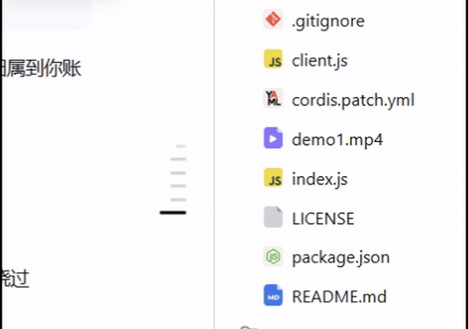

# dsh-audio-rail

**中文** | [English](README.en.md)

让 DSH Web GUI 会话页面右侧的「快捷跳转锚点」（turn rail）随系统正在播放的音乐律动——像把频谱可视化的柱形旋转了 90°。

## 效果演示



GitHub 会剥离手写 `<video>` 标签，所以用 GIF 内联自动循环播放；有声完整版见 [demo1.mp4](docs/demo1.mp4)。

## 原理

```
┌─ bin/AudioRailCapture.exe ─┐   stdout JSON    ┌─ index.js (host) ─┐   SSE    ┌─ client.js (browser) ─┐
│ WASAPI 环回采集默认渲染端点 │ ───────────────▶ │ /audio-rail/events │ ───────▶ │ 每个锚点绑定一个频段， │
│ FFT → 12 个对数频段 @30fps │                  │ /audio-rail/status │          │ scaleX 伸缩 ::before  │
└────────────────────────────┘                  └────────────────────┘          └────────────────────────┘
```

- **采集**：`src/AudioRailCapture.cs`（csc.exe 编译，零依赖单文件）以环回模式捕获默认渲染端点的系统混音（WASAPI shared mode + `AUDCLNT_STREAMFLAGS_LOOPBACK`），FFT 后归约为 12 个对数分布频段（45 Hz–16 kHz）。归一化采用「约 1 秒滑窗均值」为基准的相对动态映射（-9/+17 dB 窗口）：持续内容停在中线、鼓点瞬态上冲、弱奏回落，不会像峰值跟踪那样一直顶格。约 30 fps 输出 JSON 行，静默时输出衰减到 0。
- **宿主**：`index.js` 注册 `/audio-rail/events`（SSE）与 `/audio-rail/status`。有订阅者才启动采集进程，最后一个订阅者断开 15 秒后停止；崩溃按指数退避重启（设备热插拔 exit 3 可恢复）。
- **浏览器**：`client.js` 注入一条 CSS 规则，把锚点短条（`.…_mark::before`）的 `transform` 变为 `translateY(-50%) scaleX(var(--dsh-audio-rail-scale, 1))`；EventSource 接收频段帧，rAF 循环内对每个锚点做攻击/释放平滑后写入 CSS 变量。低音在底部锚点。尊重 `prefers-reduced-motion`（此时完全不启用）。不影响锚点原有的 active/preview/busy 状态样式（宽度与颜色照旧，只是叠加缩放）。

## 安装

克隆后先编译采集器（`build.cmd` 调用 Windows 自带的 .NET Framework csc.exe，无需安装任何依赖）：

```
build.cmd
```

然后在 DeepSeek Harness 会话里让 agent 安装 bundle，或手动：

```
dsh plugin --profile web add link:<本仓库克隆路径>
```

安装后浏览器页面自动热加载，无需刷新。

## 备注

- 本机（部分 Windows 版本/运行时组合）`IMMDevice::Activate` 对 `IID_IAudioClient` 返回 `E_NOINTERFACE`，因此 helper 按 `IAudioClient3 → IAudioClient2 → IAudioClient1` 顺序探测，并且设备以下的 COM 调用全部走原始 vtable 委托（避开该运行时对 `Activate` 封送抛 `InvalidCastException` 的问题）。
- 高采样率设备（如 192 kHz）会自动放大 FFT 点数，保证低频段分辨率。
- 卸载/禁用插件后，SSE 断开，采集进程随之退出，不产生常驻开销。
- 仅支持 Windows（WASAPI 是 Windows 音频栈）。

## 文件

| 文件 | 作用 |
| --- | --- |
| `index.js` | Host 半面：路由 + 采集进程生命周期 |
| `client.js` | 浏览器半面：样式注入 + SSE + rAF 动画 |
| `src/AudioRailCapture.cs` | WASAPI 环回采集 + FFT（C#5，csc.exe 可编译） |
| `build.cmd` | 采集器一键编译脚本（调用系统自带 csc.exe） |
| `bin/AudioRailCapture.exe` | 采集器编译产物（**不随仓库分发**，由 `build.cmd` 生成，`.gitignore` 忽略） |
| `docs/demo1.gif` | 效果演示（README 内联播放） |
| `docs/demo1.mp4` | 效果演示完整视频 |
| `cordis.patch.yml` | bundle 补丁，插入 `ui-dsh-audio-rail` 行 |

## 许可

[MIT](LICENSE)
